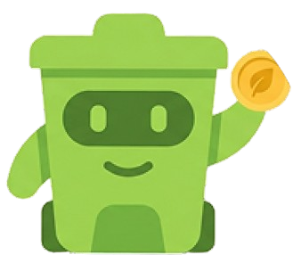
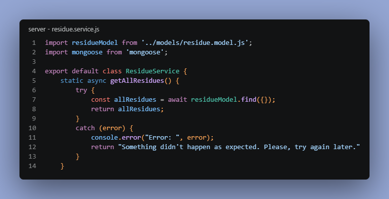

<div align="center">



# **Servidor G.R.U**

</div>

  [](https://shields.io/)

Esta RestAPI, em desenvolvimento, será utilizada em nosso Projeto Integrador Acadêmico, gerenciando o tráfego e o armazenamento de dados, gerados por nossa **Esteira** e **Website**.

Nosso projeto se baseia em uma esteira automática, acoplada à lixeiras comuns, que separa os resíduos de acordo com sua composição (vidro, metal, plástico, papel/orgânico).

[Link da Aplicação](https://gruserver-production.up.railway.app/)



---
# 🛠️ ***Funcionalidades***

### USUÁRIOS
- Cadastro de usuários.
- Atualizações cadastrais.
- Exclusão de usuário através do ID.
### RESÍDUOS
- Resgate dos resíduos armazenados usando o ID do usuário.
- Cadastro de novos resíduos, de acordo com seu tipo.
### ESTEIRAS
- Cadastro de esteiras.
- Resgate de esteiras do usuário, utilizando seu ID.
- Atualizações cadastrais

---
# 🗂️ ***Estrutura de pastas***

```text
src/
├── Controllers/
├── Database/   
├── Models/     
├── Routes/     
├── Services/   
├── Views/      
├── Public/     
|
├── app.js      
└── server.js   
```

---
# 💡 ***Tecnologias***

 - Node.js - Ambiente de execução JavaScript
 - Express.js - Framework para Node.js
 - Mongoose - Biblioteca ODM (Object Data Modeling)
 - Dotenv - Biblioteca que carrega variáveis de ambiente
 - Ejs - Template engine para gerar HTML dinâmico com JavaScript

---
# 🪧 ***Rotas***

Fluxo principal de como funciona a API integrada ao projeto.

Obs: Inicialmente, no lugar das esteiras, seria o cadastro das lixeiras onde as esteiras iriam atuar, por isso as rotas das esteiras possuem nomes correlacionados com "trash" (lixo em inglês).

 - GET - Resgate de todos os usuários cadastrados
 > https://gruserver-production.up.railway.app/users/all-users
 - POST - Cadastro de um novo usuário
 > https://gruserver-production.up.railway.app/users/new-user
 - GET - Resgate de todos as esteiras cadastradas
 > https://gruserver-production.up.railway.app/trashes/all-trashes
 - POST - Cadastro de uma nova esteira
 > https://gruserver-production.up.railway.app/users/new-trash
 - GET - Resgate de todos os resíduos registrados
 > https://gruserver-production.up.railway.app/users/all-residues
 - POST - Cadastro de um novo resíduo coletado
 > https://gruserver-production.up.railway.app/users/new-residue

---

<div align=center>
    <p style="font-size: 25px">Obrigado por visitar meu projeto!!!</p>
</div>

---